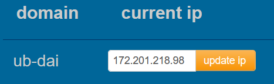

<div align="justify" style="margin-right:25px;margin-left:25px">

# DAI_PW3 <!-- omit in toc -->

## Authors <!-- omit in toc -->

- [Rodrigo Lopez Dos Santos](https://github.com/RodrigoLopesDos)
- [Urs Behrmann](https://github.com/UBehrmann) 

# Table of contents

- [Table of contents](#table-of-contents)
- [Introduction](#introduction)
- [Folder structure](#folder-structure)
- [How to run the service](#how-to-run-the-service)
  - [1 Build from source](#1-build-from-source)
  - [2 Build and run docker image](#2-build-and-run-docker-image)
  - [3 Use the docker image from GitHub packages](#3-use-the-docker-image-from-github-packages)
- [How to connect to the database with docker](#how-to-connect-to-the-database-with-docker)
- [How to create an Azure virtual machine](#how-to-create-an-azure-virtual-machine)
- [How to connect to the Azure virtual machine](#how-to-connect-to-the-azure-virtual-machine)
  - [How to add the teaching staff's public key to the virtual machine](#how-to-add-the-teaching-staffs-public-key-to-the-virtual-machine)
- [API Documentation](#api-documentation)
- [Examples of API calls](#examples-of-api-calls)
  - [Other calls](#other-calls)
- [how to configure the DNS zone](#how-to-configure-the-dns-zone)
- [Caching](#caching)
- [Encryption](#encryption)

# Introduction

This is the project for the third practical work of the Distributed Application Infrastructure course at HEIG-VD. The goal of this project is to create a CRUD server. We combined the CRUD server with a PostgreSQL database, which we did for BDR. We also created a small website to interact with the data base through the CRUD server. 

You can access the website at the following URL: [Site web](https://heig.urs-behrmann.ch/)

You can access the Traefik dashboard at the following URL: [Traefik dashboard](https://dashboard.ub-dai.duckdns.org/dashboard/#/)

# Folder structure

The Java project has 5 main packages:

- 'config': Contains the configuration classes for the database.
- 'controller': Contains the controller classes for the API.
- 'model': Contains the model classes for the database.
- 'repository': Contains the repository classes for the database.
- 'service': Contains the service classes for the API.

# How to run the service

There are 3 ways to run this service:
- Build from source with your IDE of choice
- Clone the repo and run the docker file
- Use the docker image from GitHub packages

___

## 1 Build from source

First clone this repo on your machine and `cd` in the cloned folder:

```bash
git clone git@github.com:UBehrmann/DAI_PW3.git
cd crud_server
```

###  Prerequisites  <!-- omit in toc -->

Make sure you have the following installed on your system:

- [Maven](https://maven.apache.org/)
- [SdkMan](https://sdkman.io/)

### Steps to Build and Run  <!-- omit in toc -->

1. Download the project dependencies:
```bash
./mvnw dependency:go-offline
```

2. Build the project:

```bash
./mvnw package
```

3. Run the service:

```
java -jar target/java-tcp-programming-1.0-SNAPSHOT.jar
```

___

## 2 Build and run docker image

First, clone this repository on your machine and navigate into the cloned folder:

```bash
git clone git@github.com:UBehrmann/DAI_PW3.git
cd crud_server
```

## Build the Docker Image <!-- omit in toc -->

Run the following command to build the Docker image:

```bash
docker build -t crud_server .
```

## Tag the docker images <!-- omit in toc -->

Tag the docker image with the following command:

```bash
docker tag crud_server ghcr.io/ubehrmann/crud_server:latest
```

(Update the tag with your GitHub username and the name of the repository)

## Push the docker images to GitHub Packages <!-- omit in toc -->

Push the docker image to GitHub Packages with the following command:

```bash
docker push ghcr.io/ubehrmann/crud_server:latest
```

(Update the tag with your GitHub username and the name of the repository)


### Upload the docker-compose.yml file to the Azure virtual machine <!-- omit in toc -->

To update the docker-compose.yml file on the Azure virtual machine, you can use the following command:

```bash

scp -i ~/.ssh/azure ~/DAI/DAI_PW3/docker-compose.yml ubuntu@172.201.218.98:~

```

Update the path to the docker-compose.yml file with the correct path on your machine and also the ip address of the Azure virtual machine.

### Run the Service with Docker Compose  <!-- omit in toc -->

Pull the necessary images:

```bash
docker-compose pull
```

Build and run the service along with the database, use:

```bash
docker-compose up --build
```

If the build has already been done, you can simply start the containers without rebuilding:

```bash
docker-compose start
```

To stop the containers, use:

```bash
docker-compose stop
```

To stop and remove the containers, use:

```bash
docker-compose down
```

___

## 3 Use the docker image from GitHub packages

1. Pull the Docker image from GitHub Packages:

```bash
docker pull ghcr.io/ubehrmann/crud_server:latest
```

2. Run the Docker container:

```bash
docker run -p 7000:7000 ghcr.io/ubehrmann/dai_pw3:latest
```

___

# How to connect to the database with docker

When the docker container is running, you can connect to the database with the following command:

```bash
docker exec -it postgres-db psql -U user -d mydb
```

After running this command, you will be connected to the database and can run SQL queries.

___

# How to create an Azure virtual machine

To create an Azure virtual machine, follow the steps in the following document: [Azure virtual machine](installVM.md)

___

# How to connect to the Azure virtual machine

In order to connect to the Azure virtual machine, you need to have the private key for the virtual machine. You can connect to the virtual machine with the following command:

```bash
ssh ubuntu@172.201.218.98 -i ~/.ssh/azure
```

In .ssh/azure is the private key for the azure vm.

## How to add the teaching staff's public key to the virtual machine

### Export the public key to the authorized_keys file <!-- omit in toc -->

```bash
export TEACHING_STAFF_SSH_PUBLIC_KEY="ssh-ed25519 AAAAC3NzaC1lZDI1NTE5AAAAIF5deyMbQaRaiO4ojymkCoWBtwPyG8Y+4BbLQsb413KC heig-vd-dai-course"
```


### Add the teaching staff's public key to the authorized_keys file <!-- omit in toc -->

```bash
echo "${TEACHING_STAFF_SSH_PUBLIC_KEY}" | ssh ubuntu@172.201.218.98  -i ~/.ssh/azure "cat >> ~/.ssh/authorized_keys"
```

___

# API Documentation

There are a lot of endpoints in this API. We categorized with the access point.


___

# Examples of API calls

Here are some examples of API calls that can be made to the server.

## Get all users <!-- omit in toc -->

```bash
curl -X GET https://ub-dai.duckdns.org/api/utilisateurs
```

Response:

```json
[
  {
    "nom":"Urs",
    "prenom":"Behrmann",
    "rue":"Route de Montheron",
    "noRue":"12",
    "npa":"1800",
    "lieu":"Vevey",
    "dateNaissance":null,
    "nomUtilisateur":"UBehrmann",
    "motDePasse":"C~+ftB4SWFEj6",
    "statutCompte":"ACTIF",
    "derniereConnexionDate":null,
    "derniereConnexionHeure":null
  }
]
```

## Other calls

You can look at our API documentation to see all the endpoints and the calls you can make.

To make a get request to the API, you can use the following command:

```bash
curl -X GET https://ub-dai.duckdns.org/api/endpoint
```

To make a post request to the API, you can use the following command:

```bash
curl -X POST https://ub-dai.duckdns.org/api/endpoint -d '{"key": "value"}'
```

To make a put request to the API, you can use the following command:

```bash
curl -X PUT https://ub-dai.duckdns.org/api/endpoint -d '{"key": "value"}'
```

To make a delete request to the API, you can use the following command:

```bash
curl -X DELETE https://ub-dai.duckdns.org/api/endpoint
```

All the endpoints return a JSON object or an string with the result of the request. Also the status code is returned with the request.

___

# how to configure the DNS zone

We configured the was registered with the domain name ub-dai.duckdns.org at DuckDNS.

The DNS zone is configured with the following records:



https://dashboard.ub-dai.duckdns.org/

Username: admin

Password: mypassword
___

# Caching

We had some problems implementing the caching as it was shown in the course. That's why we implemented a variant. We used a HashMap to store the data and a Timer to see if the data is still valid. If the data is still valid, we return the data from the cache. If the data is not valid anymore, we remove the data from the cache and return the data from the database.

We made also all classes static, this way concurrent access to the cache is not a problem.

We put them on most of the endpoints, but we decided not to put them on the datapoints (PointDeDonnees) which are used to get the data from the database. We did this because we wanted to have the most recent data from the database and also because the caching would the memory used would be too high.

___

# Encryption

We used let's encrypt to encrypt the website. We get the certification through traefik's tlschallenge.

</div>