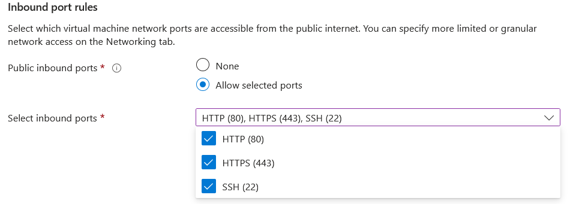

# How to install and configure the Azure virtual machine <!-- omit in toc -->

This document explains how to install and configure the Azure virtual machine.

## Table of contents <!-- omit in toc -->

- [Create an Azure account](#create-an-azure-account)
- [Create the virtual machine](#create-the-virtual-machine)

# Create an Azure account

To create an Azure account, go to the following link: [Azure](https://azure.microsoft.com/en-us/)

As a student, you can get a free account with 100$ of credit.

# Create the virtual machine

1. Go to the Azure portal: [Azure portal](https://portal.azure.com/)
2. Click on the "Virtual machines" button

3. Click on the "Create" then on "Azure virtual machine"

4. Selecte a resource group, we create a new one "heig-vd-dai-course" or use an existing one

5. Fill in the virtual machine details, give it a name and change the availability zone to "Zone 3"

6. Now, select the image, we choose "Ubuntu Server 22.04 LTS" and the size "Standard B1s"

7. For the administrator account, we choose "SSH public key" and add our own public key (not shown here)

8. For the networking, we choose "Allow selected ports" and selected "HTTP", "HTTPS" and "SSH"

9. Finally, click on "Review + create" and then on "Create"

The virtual machine is now created.

